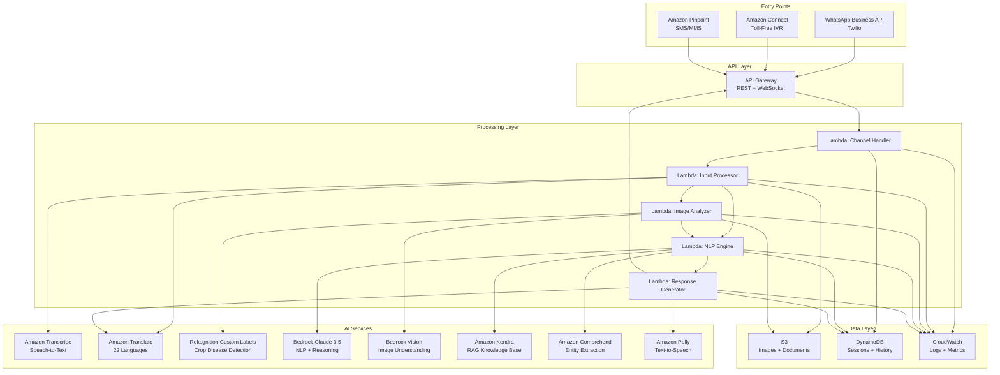
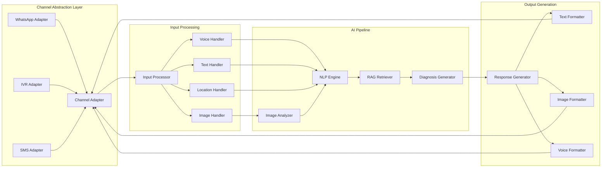

# Design Document: MITT-E-CLOUD

## Overview

MITT-E-CLOUD (Multimodal Farm Intelligence via Mobile Phone) is a serverless, cloud-native agricultural assistance system built on AWS infrastructure. The system processes multimodal inputs (images, voice, text) from farmers through multiple channels (WhatsApp, IVR, SMS) and provides AI-powered crop disease diagnosis and treatment recommendations in 22 Indian languages.

**Team Lead:** Atharva Pudale

**Architecture Philosophy:**
- Serverless-first for scalability and cost optimization
- Event-driven architecture for loose coupling
- Multi-channel abstraction for consistent user experience
- AI-first with human-in-the-loop fallback

**Key Design Decisions:**
1. **AWS Bedrock (Claude 3.5 Sonnet)** for NLP over custom models - faster development, better multilingual support
2. **Amazon Rekognition Custom Labels** for crop disease detection - pre-trained models with custom fine-tuning
3. **DynamoDB** for session storage - low latency, auto-scaling, TTL support
4. **API Gateway + Lambda** for all business logic - serverless, auto-scaling, pay-per-use
5. **Amazon Kendra** for RAG - enterprise-grade semantic search over agricultural documents

## Architecture

### System Architecture Diagram



### Data Flow

**WhatsApp Flow:**
1. Farmer sends message/image to WhatsApp Business number (Twilio)
2. Twilio webhook triggers API Gateway → Lambda: Channel Handler
3. Channel Handler extracts message, media URLs, sender info → stores in DynamoDB
4. Lambda: Input Processor downloads media from S3, transcribes voice, translates text
5. Lambda: Image Analyzer processes image using Rekognition + Bedrock Vision
6. Lambda: NLP Engine combines all inputs, queries Kendra RAG, generates diagnosis using Bedrock
7. Lambda: Response Generator translates to regional language, formats response
8. Response sent back through API Gateway → Twilio → WhatsApp

**IVR Flow:**
1. Farmer calls toll-free number → Amazon Connect answers
2. Connect plays language selection menu (Polly TTS)
3. Farmer selects language via DTMF or voice
4. Connect records farmer's problem description
5. Connect triggers Lambda via contact flow
6. Lambda processes voice → Transcribe → Translate → NLP Engine → Diagnosis
7. Lambda generates response → Translate → Polly TTS
8. Connect plays audio response to farmer
9. If photo needed, Lambda sends SMS with upload link via Pinpoint

**SMS Flow:**
1. Farmer sends SMS/MMS to shortcode → Amazon Pinpoint receives
2. Pinpoint triggers Lambda via SNS
3. Lambda extracts text and MMS image URL
4. Lambda processes inputs → Image Analyzer + NLP Engine
5. Lambda generates concise text response (160 chars or split)
6. Lambda sends response via Pinpoint

### Component Architecture



## Components and Interfaces

### 1. Channel Adapter (Lambda: Channel Handler)

**Responsibility:** Abstract channel-specific protocols into unified message format

**Interface:**
```python
class ChannelMessage:
    message_id: str
    farmer_id: str
    channel: str  # 'whatsapp', 'ivr', 'sms'
    timestamp: datetime
    language: str
    text: Optional[str]
    media_urls: List[str]
    location: Optional[Tuple[float, float]]
    metadata: Dict[str, Any]

class ChannelAdapter:
    def receive_message(event: Dict) -> ChannelMessage:
        """Parse incoming webhook/event into unified format"""
        pass
    
    def send_response(farmer_id: str, response: Response) -> bool:
        """Send response through appropriate channel"""
        pass
    
    def validate_webhook(event: Dict) -> bool:
        """Verify webhook signature for security"""
        pass
```

**WhatsApp Adapter:**
- Validates Twilio webhook signature
- Extracts message body, media URLs, sender phone number
- Downloads media from Twilio URLs to S3
- Sends responses via Twilio WhatsApp API
- Handles message status callbacks (delivered, read)

**IVR Adapter:**
- Processes Amazon Connect contact flow events
- Extracts recorded audio from S3
- Manages call state in DynamoDB
- Generates SSML for Polly TTS responses
- Handles DTMF input for menu navigation

**SMS Adapter:**
- Processes Amazon Pinpoint SNS events
- Extracts SMS text and MMS media URLs
- Splits long responses into multiple SMS
- Handles delivery receipts

### 2. Input Processor (Lambda: Input Processor)

**Responsibility:** Process raw inputs into structured data for AI analysis

**Interface:**
```python
class ProcessedInput:
    text: str  # Translated to English
    original_text: str
    language: str
    images: List[str]  # S3 URLs
    location: Optional[Location]
    audio_confidence: Optional[float]
    entities: Dict[str, Any]

class InputProcessor:
    def process_voice(audio_url: str, language: str) -> Tuple[str, float]:
        """Transcribe voice to text using Amazon Transcribe"""
        pass
    
    def process_image(image_url: str) -> str:
        """Download and validate image, return S3 URL"""
        pass
    
    def translate_to_english(text: str, source_lang: str) -> str:
        """Translate regional language to English"""
        pass
    
    def extract_location(location_data: Dict) -> Location:
        """Parse location coordinates"""
        pass
    
    def process(message: ChannelMessage) -> ProcessedInput:
        """Orchestrate all input processing"""
        pass
```

**Implementation Details:**
- **Voice Processing:** Amazon Transcribe with language-specific models, returns confidence score
- **Translation:** Amazon Translate with custom terminology for agricultural terms
- **Image Validation:** Check format (JPEG/PNG/HEIC), size (<10MB), resolution (>640x640)
- **Entity Extraction:** Amazon Comprehend for extracting crop names, symptoms, locations

### 3. Image Analyzer (Lambda: Image Analyzer)

**Responsibility:** Analyze crop images for disease detection and visual understanding

**Interface:**
```python
class ImageAnalysis:
    crop_type: str
    crop_confidence: float
    diseases: List[Disease]
    pests: List[Pest]
    nutrient_deficiencies: List[str]
    image_quality: str  # 'good', 'acceptable', 'poor'
    annotated_image_url: Optional[str]
    visual_description: str

class Disease:
    name: str
    confidence: float
    severity: str  # 'mild', 'moderate', 'severe'
    affected_area_percentage: float
    bounding_boxes: List[BoundingBox]

class ImageAnalyzer:
    def analyze_with_rekognition(image_url: str) -> Dict:
        """Use Rekognition Custom Labels for disease detection"""
        pass
    
    def analyze_with_bedrock_vision(image_url: str, context: str) -> str:
        """Use Bedrock Vision for contextual understanding"""
        pass
    
    def assess_image_quality(image_url: str) -> str:
        """Check if image is suitable for analysis"""
        pass
    
    def generate_annotated_image(image_url: str, analysis: ImageAnalysis) -> str:
        """Create annotated image with bounding boxes and labels"""
        pass
    
    def analyze(image_url: str, text_context: str) -> ImageAnalysis:
        """Combine Rekognition and Bedrock Vision analysis"""
        pass
```

**Implementation Details:**
- **Rekognition Custom Labels:** Trained on PlantVillage dataset + ICAR images
  - Crop types: 20+ common Indian crops (rice, wheat, cotton, sugarcane, etc.)
  - Diseases: 50+ common diseases per crop
  - Confidence threshold: 0.7 for crop type, 0.6 for diseases
- **Bedrock Vision (Claude 3.5 Sonnet):** Contextual understanding
  - Prompt: "Analyze this crop image. Context: {farmer_description}. Identify crop type, diseases, pests, and nutrient deficiencies."
  - Provides qualitative assessment and catches edge cases Rekognition misses
- **Image Quality Assessment:** Check blur, lighting, focus using Rekognition DetectLabels
- **Annotation:** Use PIL/Pillow to draw bounding boxes, add text labels in regional language

### 4. NLP Engine (Lambda: NLP Engine)

**Responsibility:** Understand farmer's problem, retrieve knowledge, generate diagnosis

**Interface:**
```python
class DiagnosisContext:
    farmer_id: str
    conversation_history: List[Message]
    current_input: ProcessedInput
    image_analysis: Optional[ImageAnalysis]
    location: Optional[Location]
    previous_diagnoses: List[Diagnosis]

class Diagnosis:
    diagnosis_id: str
    crop_type: str
    primary_issue: str
    issue_type: str  # 'disease', 'pest', 'nutrient', 'environmental'
    severity: str
    confidence: float
    causes: List[str]
    symptoms: List[str]
    treatment_recommendations: List[Treatment]
    preventive_measures: List[str]
    estimated_cost: Optional[float]
    urgency: str  # 'low', 'medium', 'high', 'critical'
    follow_up_questions: List[str]

class Treatment:
    name: str
    type: str  # 'organic', 'chemical', 'cultural'
    application_method: str
    dosage: str
    timing: str
    cost_estimate: float
    availability: str

class NLPEngine:
    def retrieve_knowledge(query: str, crop_type: str) -> List[Document]:
        """Query Amazon Kendra for relevant agricultural knowledge"""
        pass
    
    def extract_entities(text: str) -> Dict[str, Any]:
        """Extract crop, symptoms, duration using Comprehend"""
        pass
    
    def generate_diagnosis(context: DiagnosisContext, knowledge: List[Document]) -> Diagnosis:
        """Use Bedrock Claude to generate comprehensive diagnosis"""
        pass
    
    def assess_urgency(symptoms: List[str], severity: str) -> str:
        """Determine urgency level"""
        pass
    
    def generate_follow_up_questions(context: DiagnosisContext) -> List[str]:
        """Generate clarifying questions if needed"""
        pass
    
    def process(context: DiagnosisContext) -> Diagnosis:
        """Orchestrate NLP pipeline"""
        pass
```

**Implementation Details:**
- **Amazon Kendra RAG:**
  - Index: ICAR documents, PlantVillage articles, agricultural extension guides
  - Query: Combine farmer text + image analysis results
  - Return top 5 relevant passages with source attribution
- **Amazon Comprehend:**
  - Custom entity recognizer for crop names, diseases, pests
  - Sentiment analysis for urgency detection
- **Bedrock Claude 3.5 Sonnet:**
  - System prompt: "You are an expert agricultural advisor for Indian farmers..."
  - Input: Farmer description + image analysis + retrieved knowledge + conversation history
  - Output: Structured JSON diagnosis with treatments and recommendations
  - Temperature: 0.3 for consistent, factual responses
- **Urgency Assessment:**
  - Keywords: "spreading fast", "entire field", "yellowing rapidly" → high urgency
  - Severity + affected area → urgency score
- **Context Management:**
  - Store last 10 messages in DynamoDB
  - Include previous diagnoses in prompt for follow-ups

### 5. Response Generator (Lambda: Response Generator)

**Responsibility:** Format diagnosis into channel-appropriate responses in regional language

**Interface:**
```python
class Response:
    response_id: str
    channel: str
    language: str
    text: str
    images: List[str]
    audio_url: Optional[str]
    quick_replies: List[str]
    metadata: Dict[str, Any]

class ResponseGenerator:
    def translate_to_regional(text: str, target_lang: str) -> str:
        """Translate diagnosis to farmer's language"""
        pass
    
    def format_for_whatsapp(diagnosis: Diagnosis, language: str) -> Response:
        """Rich text with images, quick replies"""
        pass
    
    def format_for_ivr(diagnosis: Diagnosis, language: str) -> Response:
        """Concise audio script with SSML"""
        pass
    
    def format_for_sms(diagnosis: Diagnosis, language: str) -> Response:
        """Ultra-concise text within 160 chars"""
        pass
    
    def generate_audio(text: str, language: str) -> str:
        """Convert text to speech using Polly"""
        pass
    
    def generate_annotated_image(diagnosis: Diagnosis, language: str) -> str:
        """Create visual response with labels"""
        pass
    
    def generate(diagnosis: Diagnosis, channel: str, language: str) -> Response:
        """Orchestrate response generation"""
        pass
```

**Implementation Details:**
- **Translation:** Amazon Translate with custom terminology
  - Agricultural terms: disease names, treatment names preserved
  - Cultural adaptation: formal vs informal based on language
- **WhatsApp Formatting:**
  - Emoji for severity: 🟢 mild, 🟡 moderate, 🔴 severe
  - Sections: 📋 Diagnosis, 💊 Treatment, 🛡️ Prevention
  - Quick replies: "Show more details", "Ask question", "Get nearby stores"
  - Annotated image with bounding boxes
- **IVR Formatting:**
  - SSML for natural pauses: `<break time="500ms"/>`
  - Concise: "Your [crop] has [disease]. Apply [treatment] immediately."
  - Option to repeat or get SMS with details
- **SMS Formatting:**
  - Ultra-concise: "[Crop]: [Disease]. Use [Treatment]. Cost: ₹[X]. Reply HELP for more."
  - Split into 2-3 SMS if needed
- **Polly TTS:**
  - Neural voices for natural pronunciation
  - Language-specific voices: Aditi (Hindi), Kajal (Gujarati), etc.
  - SSML for emphasis on critical information

### 6. Session Manager (DynamoDB)

**Responsibility:** Maintain conversation context and farmer preferences

**Schema:**
```python
# Table: farmer_sessions
{
    "farmer_id": "string",  # Partition key: phone number
    "session_id": "string",  # Sort key: timestamp-based
    "channel": "string",
    "language": "string",
    "messages": [
        {
            "timestamp": "string",
            "role": "string",  # 'farmer' or 'system'
            "text": "string",
            "media_urls": ["string"],
            "diagnosis_id": "string"
        }
    ],
    "location": {
        "latitude": "number",
        "longitude": "number",
        "region": "string"
    },
    "preferences": {
        "preferred_channel": "string",
        "preferred_language": "string",
        "notification_enabled": "boolean"
    },
    "diagnoses": [
        {
            "diagnosis_id": "string",
            "timestamp": "string",
            "crop_type": "string",
            "issue": "string",
            "outcome": "string"  # 'resolved', 'ongoing', 'escalated'
        }
    ],
    "ttl": "number"  # Auto-delete after 7 days
}

# Table: diagnoses
{
    "diagnosis_id": "string",  # Partition key
    "farmer_id": "string",
    "timestamp": "string",
    "diagnosis": "object",  # Full Diagnosis object
    "feedback": {
        "helpful": "boolean",
        "outcome": "string",
        "comments": "string"
    },
    "ttl": "number"  # Auto-delete after 90 days
}
```

**Operations:**
- `get_session(farmer_id)`: Retrieve active session
- `create_session(farmer_id, channel, language)`: Start new session
- `add_message(session_id, message)`: Append to conversation history
- `update_preferences(farmer_id, preferences)`: Store farmer preferences
- `get_conversation_history(farmer_id, limit=10)`: Retrieve recent messages
- `save_diagnosis(diagnosis)`: Store diagnosis for analytics
- `get_previous_diagnoses(farmer_id)`: Retrieve farmer's diagnosis history

## Data Models

### Core Domain Models

```python
from dataclasses import dataclass
from typing import List, Optional, Dict, Any
from datetime import datetime
from enum import Enum

class Channel(Enum):
    WHATSAPP = "whatsapp"
    IVR = "ivr"
    SMS = "sms"

class Language(Enum):
    HINDI = "hi"
    MARATHI = "mr"
    PUNJABI = "pa"
    TAMIL = "ta"
    TELUGU = "te"
    BENGALI = "bn"
    GUJARATI = "gu"
    KANNADA = "kn"
    MALAYALAM = "ml"
    ODIA = "or"
    ASSAMESE = "as"
    ENGLISH = "en"
    # ... 10 more languages

class Severity(Enum):
    MILD = "mild"
    MODERATE = "moderate"
    SEVERE = "severe"
    CRITICAL = "critical"

class Urgency(Enum):
    LOW = "low"
    MEDIUM = "medium"
    HIGH = "high"
    CRITICAL = "critical"

@dataclass
class Location:
    latitude: float
    longitude: float
    region: Optional[str] = None
    district: Optional[str] = None
    state: Optional[str] = None

@dataclass
class BoundingBox:
    left: float
    top: float
    width: float
    height: float

@dataclass
class Disease:
    name: str
    confidence: float
    severity: Severity
    affected_area_percentage: float
    bounding_boxes: List[BoundingBox]
    symptoms: List[str]

@dataclass
class Pest:
    name: str
    confidence: float
    damage_level: Severity
    bounding_boxes: List[BoundingBox]

@dataclass
class ImageAnalysis:
    analysis_id: str
    image_url: str
    crop_type: str
    crop_confidence: float
    diseases: List[Disease]
    pests: List[Pest]
    nutrient_deficiencies: List[str]
    image_quality: str
    annotated_image_url: Optional[str]
    visual_description: str
    timestamp: datetime

@dataclass
class Treatment:
    name: str
    type: str  # 'organic', 'chemical', 'cultural'
    application_method: str
    dosage: str
    timing: str
    cost_estimate: float
    availability: str
    precautions: List[str]

@dataclass
class Diagnosis:
    diagnosis_id: str
    farmer_id: str
    timestamp: datetime
    crop_type: str
    primary_issue: str
    issue_type: str  # 'disease', 'pest', 'nutrient', 'environmental'
    severity: Severity
    urgency: Urgency
    confidence: float
    causes: List[str]
    symptoms: List[str]
    treatment_recommendations: List[Treatment]
    preventive_measures: List[str]
    estimated_cost: Optional[float]
    follow_up_questions: List[str]
    knowledge_sources: List[str]  # Citations
    image_analysis: Optional[ImageAnalysis]

@dataclass
class Message:
    message_id: str
    farmer_id: str
    channel: Channel
    timestamp: datetime
    role: str  # 'farmer' or 'system'
    language: Language
    text: Optional[str]
    original_text: Optional[str]  # Before translation
    media_urls: List[str]
    location: Optional[Location]
    diagnosis_id: Optional[str]

@dataclass
class FarmerSession:
    session_id: str
    farmer_id: str
    channel: Channel
    language: Language
    messages: List[Message]
    location: Optional[Location]
    preferences: Dict[str, Any]
    diagnoses: List[str]  # diagnosis_ids
    created_at: datetime
    updated_at: datetime
    ttl: int  # Unix timestamp for DynamoDB TTL

@dataclass
class Response:
    response_id: str
    diagnosis_id: str
    channel: Channel
    language: Language
    text: str
    images: List[str]
    audio_url: Optional[str]
    quick_replies: List[str]
    metadata: Dict[str, Any]
    timestamp: datetime
```

### AWS Service Integration Models

```python
@dataclass
class RekognitionResult:
    labels: List[Dict[str, Any]]
    custom_labels: List[Dict[str, Any]]
    confidence_threshold: float

@dataclass
class BedrockRequest:
    model_id: str  # "anthropic.claude-3-5-sonnet-20241022-v2:0"
    messages: List[Dict[str, str]]
    system: str
    max_tokens: int
    temperature: float

@dataclass
class KendraQuery:
    index_id: str
    query_text: str
    top_k: int
    attribute_filter: Optional[Dict]

@dataclass
class KendraResult:
    document_id: str
    title: str
    excerpt: str
    score: float
    source_uri: str

@dataclass
class TranscribeJob:
    job_name: str
    media_uri: str
    language_code: str
    output_bucket: str

@dataclass
class PollyRequest:
    text: str
    voice_id: str
    language_code: str
    output_format: str  # 'mp3'
    engine: str  # 'neural'
```

## Error Handling

### Error Categories

1. **Input Validation Errors**
   - Invalid image format/size
   - Unsupported language
   - Missing required fields
   - **Handling:** Return user-friendly error message with guidance

2. **External Service Errors**
   - AWS service throttling
   - Transcribe/Translate failures
   - Bedrock rate limits
   - **Handling:** Retry with exponential backoff (3 attempts), fallback to cached responses

3. **AI Analysis Errors**
   - Low confidence predictions (<0.5)
   - Image quality too poor
   - Ambiguous symptoms
   - **Handling:** Ask clarifying questions, request better photo

4. **Channel-Specific Errors**
   - WhatsApp webhook validation failure
   - IVR call drop
   - SMS delivery failure
   - **Handling:** Log error, retry delivery, send via alternate channel

### Error Response Format

```python
@dataclass
class ErrorResponse:
    error_code: str
    error_message: str  # In farmer's language
    suggested_action: str
    retry_possible: bool
    support_contact: Optional[str]

# Error codes
ERROR_CODES = {
    "IMG_001": "Image quality too low",
    "IMG_002": "Image format not supported",
    "IMG_003": "Image size exceeds limit",
    "VOICE_001": "Audio transcription failed",
    "VOICE_002": "Audio quality too low",
    "TRANS_001": "Translation service unavailable",
    "AI_001": "Unable to identify crop",
    "AI_002": "Low confidence diagnosis",
    "AI_003": "Ambiguous symptoms",
    "SYS_001": "Service temporarily unavailable",
    "SYS_002": "Request timeout",
}
```

### Retry Strategy

```python
def retry_with_backoff(func, max_attempts=3, base_delay=1):
    """Exponential backoff: 1s, 2s, 4s"""
    for attempt in range(max_attempts):
        try:
            return func()
        except RetryableError as e:
            if attempt == max_attempts - 1:
                raise
            delay = base_delay * (2 ** attempt)
            time.sleep(delay)
```

### Fallback Mechanisms

1. **AI Service Unavailable:**
   - Use cached similar diagnoses
   - Return generic advice based on symptoms
   - Escalate to human expert queue

2. **Translation Unavailable:**
   - Return response in English
   - Use pre-translated templates for common issues

3. **Image Analysis Unavailable:**
   - Process text-only diagnosis
   - Request farmer to retry later with photo

4. **All Services Down:**
   - Return acknowledgment message
   - Queue request for processing when services recover
   - Send response via SMS when ready


## Correctness Properties

*A property is a characteristic or behavior that should hold true across all valid executions of a system—essentially, a formal statement about what the system should do. Properties serve as the bridge between human-readable specifications and machine-verifiable correctness guarantees.*

### Input Processing Properties

**Property 1: Image format validation**
*For any* uploaded file, if the file format is JPEG, PNG, or HEIC and size is ≤10MB, then the system should accept it; otherwise it should reject with appropriate error message.
**Validates: Requirements 1.5**

**Property 2: Audio format validation**
*For any* uploaded audio file, if the format is MP3, WAV, or OGG and duration is ≤2 minutes, then the system should accept it; otherwise it should reject with appropriate error message.
**Validates: Requirements 1.6**

**Property 3: Multimodal context integration**
*For any* combination of inputs (text, image, voice, location), all provided inputs should be present in the unified ProcessedInput context object.
**Validates: Requirements 1.4**

**Property 4: Translation round-trip preservation**
*For any* agricultural terminology in Regional_Language, translating to English and back should preserve the core meaning of the term.
**Validates: Requirements 3.3**

**Property 5: Image processing performance**
*For any* valid crop image, the Image_Analyzer should complete processing and return ImageAnalysis within 5 seconds.
**Validates: Requirements 1.1**

### Translation and Localization Properties

**Property 6: Response translation completeness**
*For any* system response and any supported Regional_Language, the Translation_Service should produce a non-empty translated response in that language.
**Validates: Requirements 3.2**

**Property 7: Language support coverage**
*For any* of the 3 prototype languages (Hindi, English, Marathi), the system should successfully translate text to and from English.
**Validates: Requirements 19.1**

**Property 8: Annotated image localization**
*For any* annotated image and any Regional_Language, all text labels on the image should be in the specified language.
**Validates: Requirements 10.3**

### Image Analysis Properties

**Property 9: Crop identification accuracy**
*For any* labeled test image from the validation set, the Image_Analyzer should identify the correct crop type with ≥90% accuracy across the entire dataset.
**Validates: Requirements 4.1**

**Property 10: Disease detection accuracy**
*For any* labeled diseased crop image from the validation set, the Image_Analyzer should correctly classify the disease with ≥85% accuracy across the entire dataset.
**Validates: Requirements 4.2**

**Property 11: Pest detection accuracy**
*For any* labeled pest damage image from the validation set, the Image_Analyzer should correctly identify the pest type with ≥80% accuracy across the entire dataset.
**Validates: Requirements 4.3**

**Property 12: Image quality assessment**
*For any* image with insufficient quality (blurry, dark, or low resolution), the Image_Analyzer should detect poor quality and return specific guidance for improvement.
**Validates: Requirements 4.5**

**Property 13: Annotation generation**
*For any* ImageAnalysis with detected diseases or pests, the system should generate an annotated image with bounding boxes highlighting the detected issues.
**Validates: Requirements 4.6, 10.1**

**Property 14: Severity color coding**
*For any* annotated image, severity markers should use correct colors: green for healthy, yellow for moderate, red for severe.
**Validates: Requirements 10.2**

### NLP and Diagnosis Properties

**Property 15: Entity extraction completeness**
*For any* farmer description containing crop type, symptoms, and duration, the NLP_Engine should extract all present entities.
**Validates: Requirements 5.1**

**Property 16: Conversation context persistence**
*For any* multi-turn conversation, when a farmer asks a follow-up question, the NLP_Engine should have access to all previous messages in the session.
**Validates: Requirements 5.2, 8.3**

**Property 17: Ambiguity handling**
*For any* input with ambiguous symptoms (confidence <0.6), the NLP_Engine should generate clarifying questions before providing final diagnosis.
**Validates: Requirements 5.3**

**Property 18: Urgency detection**
*For any* symptom description, the NLP_Engine should assign an urgency level (low, medium, high, critical) based on symptom severity and spread rate.
**Validates: Requirements 5.5**

**Property 19: Knowledge retrieval**
*For any* diagnosis query, the RAG_System should return exactly 5 most relevant document chunks from the knowledge base.
**Validates: Requirements 6.2, 6.3**

**Property 20: Diagnosis completeness**
*For any* generated diagnosis, it should include all required fields: disease identification, severity assessment, treatment recommendations, and preventive measures.
**Validates: Requirements 7.1, 7.6**

**Property 21: Treatment variety**
*For any* diagnosis with treatment recommendations, it should include at least one organic option and one chemical option (where applicable).
**Validates: Requirements 7.2**

**Property 22: Cost estimation presence**
*For any* diagnosis with treatment recommendations, each treatment should include a cost estimate in INR.
**Validates: Requirements 7.4**

**Property 23: Multiple diagnosis ranking**
*For any* ambiguous case with multiple possible diagnoses, all diagnoses should be ranked by confidence score in descending order.
**Validates: Requirements 7.5**

### Session Management Properties

**Property 24: Session data round-trip**
*For any* farmer session stored in DynamoDB, retrieving the session by farmer_id should return an equivalent session object with all messages and metadata.
**Validates: Requirements 8.2, 8.4, 15.1**

**Property 25: Session TTL configuration**
*For any* created session, the TTL field should be set to current_timestamp + 7 days.
**Validates: Requirements 8.1, 15.4**

**Property 26: Preference persistence**
*For any* farmer preferences (language, channel) stored in the session, retrieving the session should return the same preferences.
**Validates: Requirements 8.4**

### Location-Based Properties

**Property 27: Location extraction and storage**
*For any* location data provided by a farmer, the system should extract coordinates and store them in the session.
**Validates: Requirements 9.1**

**Property 28: Regional alert targeting**
*For any* disease outbreak detected in a region, the system should send alerts only to farmers within that geographic region.
**Validates: Requirements 9.5**

### Channel-Specific Properties

**Property 29: WhatsApp response time**
*For any* message sent to WhatsApp_Bot, the system should respond within 10 seconds.
**Validates: Requirements 2.1**

**Property 30: SMS response time**
*For any* SMS sent to the shortcode, the system should respond within 30 seconds.
**Validates: Requirements 11.2**

**Property 31: SMS message splitting**
*For any* response text exceeding 160 characters, the SMS_Gateway should split it into multiple SMS messages, each ≤160 characters.
**Validates: Requirements 11.5**

**Property 32: Channel-appropriate media**
*For any* response, if the channel is WhatsApp, visual responses (images) should be included; if the channel is IVR, only audio should be included; if SMS, only text.
**Validates: Requirements 10.4**

**Property 33: Quick reply buttons**
*For any* WhatsApp response, it should include quick reply buttons for common actions (e.g., "Ask question", "Get details").
**Validates: Requirements 12.4**

**Property 34: Concurrent conversation handling**
*For any* set of concurrent requests from different farmers, each should be processed independently with correct session isolation.
**Validates: Requirements 12.5**

### Error Handling and Resilience Properties

**Property 35: Retry with exponential backoff**
*For any* external service call that fails, the system should retry up to 3 times with exponential backoff (1s, 2s, 4s).
**Validates: Requirements 20.1**

**Property 36: Localized error messages**
*For any* error condition, the error message returned to the farmer should be in their selected Regional_Language.
**Validates: Requirements 20.2**

**Property 37: Low confidence handling**
*For any* voice transcription with confidence <70%, the system should ask the farmer to repeat or type their message.
**Validates: Requirements 20.4**

**Property 38: Fallback response availability**
*For any* AI service failure (Bedrock, Rekognition), the system should return a fallback response rather than crashing.
**Validates: Requirements 20.5**

**Property 39: Error logging completeness**
*For any* error that occurs, the system should log the error with context including farmer_id, timestamp, error_code, and stack trace.
**Validates: Requirements 20.6**

### Security Properties

**Property 40: API authentication enforcement**
*For any* API endpoint call without a valid API key, the system should reject the request with 401 Unauthorized.
**Validates: Requirements 18.1**

**Property 41: PII anonymization in logs**
*For any* log entry, it should not contain personally identifiable information (phone numbers, names, exact locations).
**Validates: Requirements 18.2**

**Property 42: Rate limiting per farmer**
*For any* farmer sending more than 10 requests per minute, subsequent requests should be throttled with 429 Too Many Requests.
**Validates: Requirements 18.4**

**Property 43: Input sanitization**
*For any* user input containing potential injection patterns (SQL, NoSQL, command injection), the system should sanitize or reject the input.
**Validates: Requirements 18.5**

**Property 44: Data deletion completeness**
*For any* farmer requesting data deletion, all their data (sessions, diagnoses, images) should be removed from all storage systems.
**Validates: Requirements 18.6**

### Monitoring and Observability Properties

**Property 45: Request/response logging**
*For any* API request, the system should log both the request and response to CloudWatch Logs.
**Validates: Requirements 16.1**

**Property 46: Metrics emission**
*For any* completed request, the system should emit metrics including response_time, channel, language, and success/failure status.
**Validates: Requirements 16.2**

**Property 47: Alert triggering**
*For any* 5-minute window where error rate exceeds 5%, the system should trigger a CloudWatch alarm.
**Validates: Requirements 16.3**

**Property 48: Distributed tracing**
*For any* request, the system should create X-Ray segments for each Lambda function and external service call.
**Validates: Requirements 16.4**

### Performance Properties

**Property 49: Concurrent load handling**
*For any* load of 100 concurrent requests, the system should successfully process all requests without failures.
**Validates: Requirements 19.4**

**Property 50: Circuit breaker activation**
*For any* external service with >50% failure rate over 1 minute, the circuit breaker should open and prevent further calls for 30 seconds.
**Validates: Requirements 14.6**

## Testing Strategy

### Dual Testing Approach

MITT-E-CLOUD requires both unit testing and property-based testing for comprehensive coverage:

**Unit Tests:**
- Specific examples demonstrating correct behavior
- Edge cases (empty inputs, boundary values, special characters)
- Error conditions (invalid formats, missing data, service failures)
- Integration points between components
- Channel-specific behavior (WhatsApp, IVR, SMS)

**Property-Based Tests:**
- Universal properties that hold for all inputs
- Comprehensive input coverage through randomization
- Minimum 100 iterations per property test
- Each test tagged with: **Feature: mitt-e-cloud, Property {number}: {property_text}**

### Testing Framework Selection

**Python (Recommended for AWS Lambda):**
- Property-based testing: **Hypothesis**
- Unit testing: **pytest**
- Mocking: **moto** (for AWS services), **pytest-mock**
- Integration testing: **boto3** with LocalStack

**TypeScript (Alternative):**
- Property-based testing: **fast-check**
- Unit testing: **Jest**
- Mocking: **aws-sdk-mock**

### Test Organization

```
tests/
├── unit/
│   ├── test_channel_adapter.py
│   ├── test_input_processor.py
│   ├── test_image_analyzer.py
│   ├── test_nlp_engine.py
│   ├── test_response_generator.py
│   └── test_session_manager.py
├── property/
│   ├── test_input_properties.py
│   ├── test_translation_properties.py
│   ├── test_image_analysis_properties.py
│   ├── test_nlp_properties.py
│   ├── test_session_properties.py
│   ├── test_channel_properties.py
│   ├── test_error_handling_properties.py
│   └── test_security_properties.py
├── integration/
│   ├── test_whatsapp_flow.py
│   ├── test_sms_flow.py
│   └── test_end_to_end.py
└── fixtures/
    ├── sample_images/
    ├── sample_audio/
    └── test_data.json
```

### Property Test Configuration

Each property test must:
1. Run minimum 100 iterations
2. Use appropriate generators for test data
3. Include a comment tag referencing the design property
4. Test the universal property, not specific examples

**Example Property Test (Hypothesis):**

```python
from hypothesis import given, strategies as st
import pytest

# Feature: mitt-e-cloud, Property 1: Image format validation
@given(
    file_format=st.sampled_from(['JPEG', 'PNG', 'HEIC', 'GIF', 'BMP']),
    file_size=st.integers(min_value=0, max_value=15_000_000)
)
def test_image_format_validation(file_format, file_size):
    """
    Property 1: For any uploaded file, if the format is JPEG/PNG/HEIC 
    and size ≤10MB, accept it; otherwise reject with error.
    """
    result = validate_image(file_format, file_size)
    
    valid_formats = ['JPEG', 'PNG', 'HEIC']
    max_size = 10 * 1024 * 1024  # 10MB
    
    if file_format in valid_formats and file_size <= max_size:
        assert result.is_valid == True
        assert result.error is None
    else:
        assert result.is_valid == False
        assert result.error is not None
        assert 'format' in result.error or 'size' in result.error
```

### Test Data Requirements

**Image Test Data:**
- PlantVillage validation set (20% holdout)
- Synthetic images with known diseases
- Poor quality images (blurry, dark, low-res)
- Edge cases (very small, very large, unusual aspect ratios)

**Text Test Data:**
- Agricultural terminology in 3 languages
- Common farmer queries and descriptions
- Ambiguous symptom descriptions
- Edge cases (empty, very long, special characters)

**Audio Test Data:**
- Recorded farmer queries in 3 languages
- Various audio qualities and background noise levels
- Edge cases (very short, very long, silence)

### Integration Testing

**WhatsApp Flow Test:**
1. Send test message via Twilio sandbox
2. Verify webhook received and processed
3. Verify response sent back through Twilio
4. Check session created in DynamoDB
5. Verify image uploaded to S3

**SMS Flow Test:**
1. Send test SMS via Pinpoint
2. Verify SNS event processed
3. Verify response sent via Pinpoint
4. Check message splitting for long responses

**End-to-End Test:**
1. Farmer sends crop image + description via WhatsApp
2. System processes image (Rekognition + Bedrock Vision)
3. System processes text (Translate + Bedrock NLP)
4. System retrieves knowledge (Kendra)
5. System generates diagnosis (Bedrock)
6. System translates response (Translate)
7. System sends response with annotated image
8. Verify complete flow in <10 seconds

### Mocking Strategy

**Mock External AWS Services in Unit Tests:**
- Use **moto** to mock S3, DynamoDB, CloudWatch
- Use **unittest.mock** to mock Bedrock, Rekognition, Translate
- Return realistic responses based on test fixtures

**Use Real Services in Integration Tests:**
- Use AWS sandbox/dev environment
- Use Twilio test credentials
- Use small test datasets

### Performance Testing

**Load Testing:**
- Use **Locust** or **Artillery** to simulate concurrent users
- Test 100 concurrent requests (prototype requirement)
- Measure response times, error rates, throughput
- Verify auto-scaling behavior

**Stress Testing:**
- Gradually increase load to find breaking point
- Test circuit breaker activation
- Test fallback mechanisms under load

### Continuous Testing

**Pre-commit Hooks:**
- Run unit tests
- Run linting (pylint, black)
- Check code coverage (>80%)

**CI/CD Pipeline:**
- Run all unit tests
- Run property tests (100 iterations each)
- Run integration tests
- Deploy to dev environment
- Run smoke tests
- Deploy to staging
- Run full test suite
- Manual approval for production

### Test Coverage Goals

- **Unit test coverage:** >80% line coverage
- **Property test coverage:** All 50 properties implemented
- **Integration test coverage:** All 3 channels (WhatsApp, SMS, IVR)
- **End-to-end test coverage:** Complete user flows for each channel

## Implementation Considerations for Hackathon

### 2-Week Timeline Breakdown

**Week 1: Core Infrastructure & AI Pipeline**
- Days 1-2: AWS infrastructure setup (Lambda, API Gateway, DynamoDB, S3)
- Days 3-4: Channel adapters (WhatsApp, SMS)
- Days 5-7: Image analysis pipeline (Rekognition + Bedrock Vision)

**Week 2: NLP & Integration**
- Days 8-9: NLP engine with RAG (Bedrock + Kendra)
- Days 10-11: Response generation and translation
- Days 12-13: End-to-end testing and bug fixes
- Day 14: Demo preparation and documentation

### Prototype Scope Limitations

**Included in Prototype:**
- 3 languages (Hindi, English, Marathi)
- 2 channels (WhatsApp, SMS)
- 10 common crop diseases
- Basic monitoring dashboard
- Core diagnosis flow

**Deferred Post-Hackathon:**
- Full 22-language support
- IVR channel
- Advanced features (proactive alerts, location-based recommendations)
- Production-grade security and compliance
- Comprehensive error handling
- A/B testing infrastructure

### Quick Wins for Demo

1. **Pre-trained Models:** Use Rekognition Custom Labels with PlantVillage dataset (no training needed)
2. **Bedrock Prompts:** Focus on prompt engineering rather than model training
3. **Sample Data:** Use curated test images that work well
4. **Simplified UI:** Focus on WhatsApp as primary channel
5. **Mock Services:** Mock some AWS services if quota limits hit

### Risk Mitigation

**Risk: AWS Service Quotas**
- Mitigation: Request quota increases early, use LocalStack for development

**Risk: Model Accuracy Too Low**
- Mitigation: Use ensemble of Rekognition + Bedrock Vision, focus on common diseases

**Risk: Translation Quality Issues**
- Mitigation: Use custom terminology, focus on 3 languages, manual review

**Risk: Integration Complexity**
- Mitigation: Start with WhatsApp only, add SMS later, defer IVR

**Risk: Performance Issues**
- Mitigation: Optimize Lambda memory, use caching, implement timeouts

### Success Criteria for Hackathon Demo

1. ✅ Farmer sends crop image via WhatsApp
2. ✅ System identifies crop type correctly
3. ✅ System detects disease (if present)
4. ✅ System provides diagnosis in Hindi/Marathi
5. ✅ System includes treatment recommendations
6. ✅ Complete flow in <10 seconds
7. ✅ Handle 10 concurrent demo users
8. ✅ Basic monitoring dashboard showing metrics

### Post-Hackathon Roadmap

**Phase 1 (Month 1-2):** Production Hardening
- Add remaining 19 languages
- Implement IVR channel
- Production security and compliance
- Comprehensive error handling
- Load testing and optimization

**Phase 2 (Month 3-4):** Advanced Features
- Proactive location-based alerts
- Weather integration
- Soil testing integration
- Farmer feedback loop
- Model improvement pipeline

**Phase 3 (Month 5-6):** Scale & Partnerships
- Scale to 10,000+ farmers
- Partner with agricultural extension services
- Integrate with supply chain
- Mobile app development
- Video consultation feature

## Appendix

### AWS Service Costs (Estimated for Prototype)

- **Lambda:** ~$5/month (1M requests)
- **API Gateway:** ~$3.50/month (1M requests)
- **DynamoDB:** ~$2/month (on-demand, low volume)
- **S3:** ~$1/month (10GB storage)
- **Bedrock:** ~$50/month (Claude 3.5 Sonnet, 1M tokens)
- **Rekognition:** ~$10/month (10K images)
- **Translate:** ~$15/month (1M characters)
- **Transcribe:** ~$10/month (1K minutes)
- **Polly:** ~$4/month (1M characters)
- **Kendra:** ~$810/month (Developer Edition)
- **Twilio WhatsApp:** ~$5/month (1K messages)
- **Pinpoint SMS:** ~$10/month (1K SMS)

**Total Estimated Cost:** ~$925/month for prototype with 1,000 active farmers

### Key AWS Service Configurations

**Lambda Functions:**
- Runtime: Python 3.11
- Memory: 512MB (channel handlers), 1024MB (image analyzer), 2048MB (NLP engine)
- Timeout: 30 seconds (channel handlers), 60 seconds (image/NLP)
- Environment Variables: API keys, S3 bucket names, DynamoDB table names

**API Gateway:**
- Type: REST API
- Authorization: API Key
- Throttling: 100 requests/second per API key
- CORS: Enabled for webhook endpoints

**DynamoDB Tables:**
- farmer_sessions: On-demand, TTL enabled
- diagnoses: On-demand, TTL enabled
- Point-in-time recovery: Enabled

**S3 Buckets:**
- images-bucket: Versioning disabled, lifecycle policy (archive after 90 days)
- audio-bucket: Versioning disabled, lifecycle policy (delete after 30 days)
- knowledge-base-bucket: Versioning enabled

**Kendra Index:**
- Edition: Developer Edition (for prototype)
- Data sources: S3 bucket with ICAR documents
- Query capacity: 0.5 units

### References

- **PlantVillage Dataset:** https://github.com/spMohanty/PlantVillage-Dataset
- **ICAR Agricultural Portal:** https://icar.org.in/
- **AWS Bedrock Documentation:** https://docs.aws.amazon.com/bedrock/
- **Amazon Rekognition Custom Labels:** https://docs.aws.amazon.com/rekognition/latest/customlabels-dg/
- **Amazon Kendra:** https://docs.aws.amazon.com/kendra/
- **Twilio WhatsApp API:** https://www.twilio.com/docs/whatsapp
- **Amazon Connect:** https://docs.aws.amazon.com/connect/
- **Amazon Pinpoint:** https://docs.aws.amazon.com/pinpoint/
